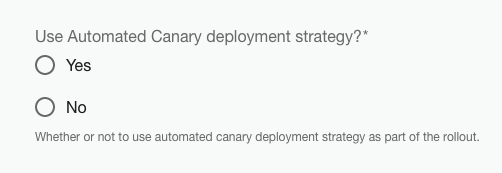

# Spring Boot Deployment Template

The **Spring Boot Deployment** templates creates a ArgoCD compliant deployment repository for an existing application. Once created the repository will:

* Create a standard deployment layout with
  * a common `bases/`.
  * a fully specified  `environments/regions/clusters`
* Defaults to a rolling update deployment model
* Can choose to use an automated canary rollout with basic metrics analysis


## Deployment models

The **Spring Boot Deployment** template allows for two types of deployment models, _rolling updates_ and _automated canary rollout_.

### Rolling Update

By default, the deployment uses an Argo `Rollout` configured to simply do a standard rolling update.

```yaml
apiVersion: argoproj.io/v1alpha1
kind: Rollout
metadata:
  name: sample-service
spec:
  replicas: 2
  revisionHistoryLimit: 3
  workloadRef:
    apiVersion: apps/v1
    kind: Deployment
    name: sample-service
  strategy:
    canary:
      stableService: sample-service
      canaryService: sample-service-canary
```

This is the default type of strategy used by an Argo `Rollout` when no `spec.strategy.canary.steps` are specified.


### Automated Canary Rollout

In addition to the standard rolling update, an option is available to deploy using an automated canary strategy with metrics analysis.



When this is enabled the deployment will use an automated canary deployment strategy.  This deployment strategy will analyze the prometheus metrics of HTTP response success rates as it progressively shifts the traffic from stable pods to canary pods over a period of time.

```yaml
apiVersion: argoproj.io/v1alpha1
kind: Rollout
metadata:
  name: sample-service
spec:
  #
  # replicas are managed by the Rollout and not the Deployment
  #
  replicas: 5
  revisionHistoryLimit: 3
  #
  # reference to the K8S `Deployment` for this service
  # its replicas should be set to zero
  #
  workloadRef:
    apiVersion: apps/v1
    kind: Deployment
    name: sample-service
  strategy:
    canary:
      stableService: sample-service
      canaryService: sample-service-canary
      #
      # analysis template to run
      #
      analysis:
        templates:
          - templateName: http-success-rate
            clusterScope: true
        args:
          - name: service-name
            value: sample-service-canary
          - name: product
            value: cicd
      #
      # steps taken to shift traffic
      # from stable to canary
      #
      steps:
        - setWeight: 20
        - pause: { duration: 10m }
        - setWeight: 40
        - pause: { duration: 10m }
        - setWeight: 60
        - pause: { duration: 10m }
```

The `Rollout` above is the type generated when the option to use the _automated canary_ deployment strategy is selected.  In this case, the following sections are included:

| Section                         | Description                                |
| ------------------------------- | ------------------------------------------ |
| `spec.strategy.canary.steps[]`  | These are the steps which will be taken to shift traffic from stable pods to canary pods. This example shifts traffic from 20% -> 40% -> 60% -> 100% with 10m pauses between shifts.  |
| `spec.strategy.canary.analysis` | These are the analysis templates that will be run in the background as traffic is shifted in the rollout.  If this analysis were to fail, the rollout would be aborted and all traffic would be returned to stable pods. |


### Rollout Steps

The `steps[]` used in this example

```yaml
apiVersion: argoproj.io/v1alpha1
kind: Rollout
metadata:
  name: sample-service
spec:
  replicas: 5
  ...
  strategy:
    canary:
      ...
      steps:
        - setWeight: 20
        - pause: { duration: 10m }
        - setWeight: 40
        - pause: { duration: 10m }
        - setWeight: 60
        - pause: { duration: 10m }
```
start by setting the percentage of traffic that should be shifted to the canary pods, which in this case is 20% of traffic.  Because this base deployment does not use an NGINX Ingress (a more advanced option) it instead relies on replica counts to achieve the percentage of traffic shift.  So, for example, this `Rollout` specifies that we should have `5` replicas available.  By shifting the replica count between _stable_ and _canary_ pods, we are able to shift traffic by `20%` increments.  (1 canary / 4 stable = 20% ; 2 canary / 3 stable = 40%, etc...)

Seen this way, the `steps[]` for this `Rollout` can be seen as doing the following:

* `setWeight: 20` - bring up `1` canary pod and scale down stable pods to `4`.
* `pause: { duration : 10m }` - pause for 10 mins.
* `setWeight: 40` - bring up `2` canary pods and scale down stable pods to `3`.
* `pause: { duration : 10m }` - pause for 10 mins.
* `setWeight: 60` - bring up `3` canary pods and scale down stable pods to `2`.
* `pause: { duration : 10m }` - pause for 10 mins.
* promote canary to stable with 100% of traffic now on the new stable pods. (_Implicit_)

The last step is implicit as when all the steps are completed, if there are no errors, the canary is automatically promoted to be the new stable pods and the rollout deployment is completed.

For more information on options available for use in the `spec.strategy.canary.steps[]` section, see the [Argo Rollout documentation on the canary deployment strategy](https://argoproj.github.io/argo-rollouts/features/canary/).

### Analysis Templates

When _automated canary strategy_ is chosen, the `Rollout` is configured to use an _analysis_ during the rollout of the canary pods.

```yaml
  ...
  strategy:
    canary:
      stableService: sample-service
      canaryService: sample-service-canary
      #
      # analysis template to run
      #
      analysis:
        templates:
          - templateName: http-success-rate
            clusterScope: true
        args:
          - name: service-name
            value: sample-service-canary
          - name: product
            value: cicd
      ...
```

The `analysis.templates` section above indicates tha the `http-success-rate` will be used as a _background_ analysis that will occur during the progressive transition of traffic to the canary pods. (i.e. during the execution of the `steps[]`).  If that analysis run were to fail at any point during the rollout, the rollout would be aborted and all traffic would be routed back to the original stable pods.

If, on the other hand, the analysis were to successfully make it through the rollout `steps[]` without signalling a failure, then the rollout will be considered a success and the canary pods will be promoted to be the new stable pods.

The `analysis.args` list contains input parameters to the `http-success-rate` analysis template.  For more information on the `http-success-rate` analysis template specifically, and other available analysis templates currently available for use, please see the [Analysis Templates documentation here](docs/default/Component/argo-rollouts-deployment/).
